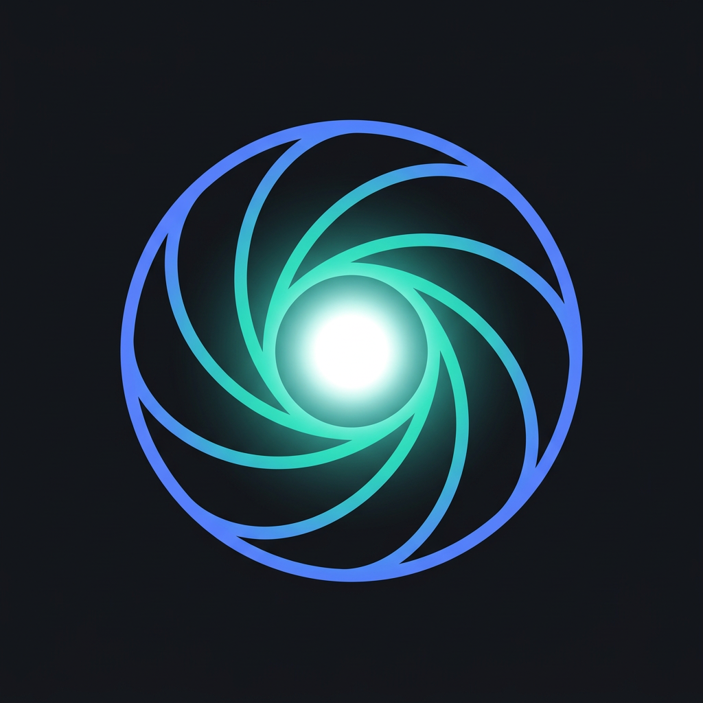
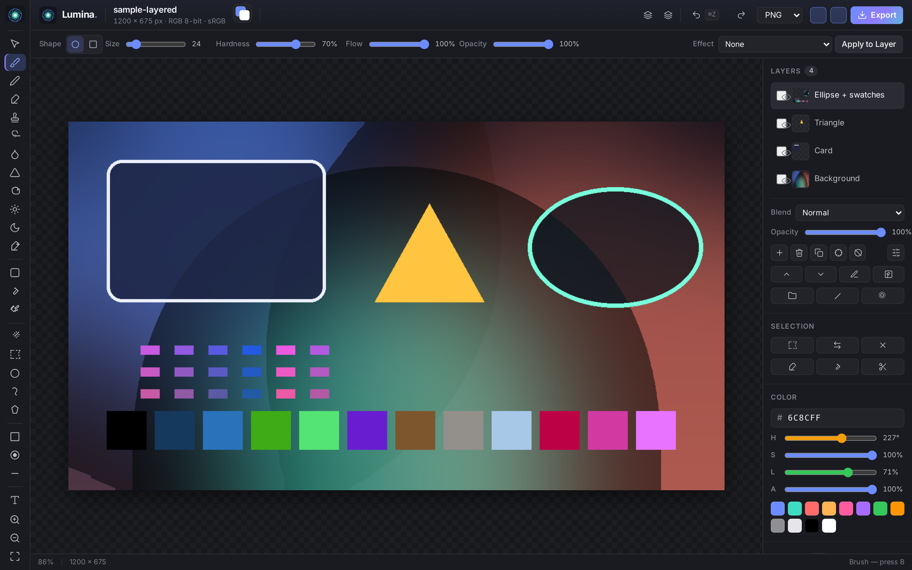
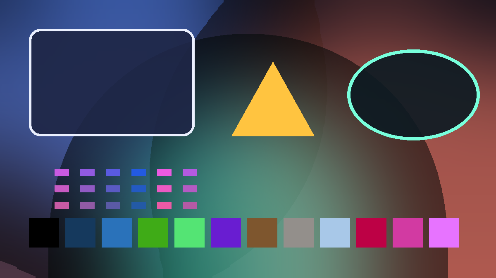

<div align="center">



# Lumina

**A fast, dependency-light image editor with a PSD engine written from scratch.**

Layered PSD read/write · native Curves, Levels & Exposure · vector masks · layer effects · ICC colour management · tile-based compositing

[](https://github.com/ZALPRO/lumina/actions/workflows/ci.yml)
[](https://github.com/ZALPRO/lumina/actions/workflows/release.yml)
[](LICENSE)
[](package.json)
[](#verification)
[](#install)

[Install](#install) · [Features](#features) · [Verification](#verification) · [Architecture](#architecture) · [Contributing](CONTRIBUTING.md)



</div>

---

## Why Lumina

Most editors treat PSD as somebody else's problem: shell out to a native library,
lose half the document on import, or skip layers entirely. Lumina implements the
file format itself — the header, the layer records, the tagged blocks (`lfx2`,
`vmsk`, `Crv `), the compression schemes (RAW, PackBits RLE, ZIP and ZIP with
prediction), the CMYK polarity Photoshop actually writes, and the ICC profile
that keeps colours honest in managed readers.

The result is a small, auditable editor whose PSD pipeline is verified against
real Photoshop files with an independent toolchain — not against itself.

## Features

**Documents & layers**

- Non-destructive adjustment layers: Curves, Levels, Brightness/Contrast, Invert, Posterize, Exposure, Hue/Saturation, Threshold, Vibrance
- 27 Photoshop blend modes in linear space, per-layer opacity, groups, clipping masks
- Layer masks, vector masks (`vmsk`) with real bezier knots, and layer styles (`lfx2` / legacy `lrFX`): drop shadow, stroke, colour overlay
- Editable text layers with bundled fonts and live re-rendering
- Tile-based paint engine with copy-on-write copies, so undo/redo and layer duplication stay cheap
- Unified history panel and navigator, marching-ants selections, lasso, magic wand, gradient, shape and clone tools

**Colour & formats**

- ICC-aware PNG read/write; embedded sRGB profile is a standards-compliant one (D50 white point, Bradford `chad`, parametric type-3 curve)
- Open: PNG, JPEG, WebP, GIF, BMP, QOI, TIFF, DNG, PSD, PSB — including **RGB, CMYK, Grayscale, Bitmap (1-bit), Indexed and Lab** documents at 8/16/32-bit
- Save: PNG, JPEG, TIFF, BMP, QOI, PSD, and layered PSD (RAW / RLE / ZIP / ZIP+prediction, RGB / CMYK / Grayscale, 8 / 16-bit)
- Zero runtime dependencies for the engine: the PNG, JPEG, TIFF, WebP, QOI, ZIP and PSD codecs are all in `src/formats/`

**Apps**

- Web app (`npm run web`) — the whole UI, served statically
- Desktop app (Electron) for macOS, Windows and Linux — same UI, native window, no network access

## Install

### Run from source (all platforms)

```bash
git clone https://github.com/ZALPRO/lumina.git
cd lumina
npm install
npm run web          # http://localhost:4173
# or the desktop shell:
npm start
```

Requires **Node.js 20+**. On Linux, Electron needs the usual GTK/NSS libraries —
see [docs/INSTALL.md](docs/INSTALL.md) for the exact package list per distribution.

### Prebuilt binaries

Download from [Releases](https://github.com/ZALPRO/lumina/releases):

| Platform | Artifact | Notes |
|---|---|---|
| **macOS** | `Lumina-1.0.0-mac-arm64.dmg` / `Lumina-1.0.0-mac-x64.dmg` | Apple Silicon / Intel. Unsigned builds: first launch via right-click → **Open** |
| **Linux** | `Lumina-1.0.0-linux-x86_64.AppImage` | `chmod +x` then run — no install needed |
| **Linux (Debian/Ubuntu)** | `Lumina-1.0.0-linux-amd64.deb` | `sudo apt install ./Lumina-1.0.0-linux-amd64.deb` |
| **Linux (portable)** | `Lumina-1.0.0-linux-x64.tar.gz` | unpack and run `./Lumina` |
| **Windows** | `Lumina-Setup-1.0.0-win-x64.exe` | installer, or the portable `.exe` |

Step-by-step instructions, including how to build your own macOS/Linux packages
and how to self-sign on macOS, are in **[docs/INSTALL.md](docs/INSTALL.md)**.

## Verification

Lumina is checked against **independent** tools (`psd-tools` 1.19 and Pillow),
using **real Photoshop documents**, and the reference is always the raw plane
data inside the file — never our own decoder output.

```bash
npm test                   # 274 tests (unit + format + real-browser UI)
npm run verify:corpus      # 30 curated real Photoshop files
npm run verify:corpus:download   # download that set from the psd-tools repo
npm run verify:corpus:all  # every .psd in the reference repo (254 files)
npm run verify:psd         # build a feature-rich PSD and validate it externally
```

| Check | Result |
|---|---|
| Photoshop corpus (every `.psd` in the reference repo: 254 files) | **253 match, 0 pixel differences**; 1 file is a *Multichannel* document, a mode with no RGB meaning |
| Curated set of 30 files (RGB/CMYK/Gray/Bitmap/Indexed/Lab, 8/16/32-bit, RAW/RLE/ZIP) | **30 / 30 match** |
| Layered PSD round-trip (RLE, ZIP+prediction, CMYK) composited by `psd-tools` | **0 pixels differ** |
| Per-layer channel planes vs. encoder input | **identical** |
| Automated tests | **274 passing** (incl. 25 in a real headless browser) |
| ICC identity transform vs. LCMS | max 1 level, mean 0.0014 |

Full evidence, method and the honest list of remaining limitations:
**[docs/VERIFICATION.md](docs/VERIFICATION.md)**.

<div align="center">
<br>
<sub>Artwork generated by <code>npm run sample</code> and exported as a real layered PSD.</sub>
</div>

## Architecture

```
src/
  document/   document · layer · tile-based Paint (copy-on-write) · history
  engine/     blend modes (linear space) · filters · adjustments · fx · inpaint · layers styles
  formats/    png · jpeg · tiff · webp · bmp · qoi · psd (read/write) · psd-layers · icc · deflate
  tools/      brush · flood fill · paint tools · clone
  text/       text layer spec + rasterisation
ui/           the editor UI (framework-free ES modules)
electron/     desktop shell: app:// protocol, sandboxed renderer, single instance
cli/          headless entry points (demo, thumbnails, conversion)
tools/        independent verification harnesses
```

Deep-dive documentation: **[docs/ARCHITECTURE.md](docs/ARCHITECTURE.md)** ·
PSD format notes: **[docs/PSD.md](docs/PSD.md)** ·
Verification method: **[docs/VERIFICATION.md](docs/VERIFICATION.md)**.

## Known limitations

- **Multichannel** documents are rejected (an arbitrary channel set has no RGB meaning). Lab, Duotone, Bitmap and Indexed are decoded.
- Smart Objects are flattened to pixel layers; their transform metadata is not retained.
- Embedded **CMYK** ICC profiles are ignored on import (CMYK→RGB uses the standard formula).
- 32-bit documents can be *opened* but are saved at 8/16-bit.
- Some layer effects (gradient/pattern overlays, inner glow) are read but not re-rendered.
- Rendering is CPU-only; there is no GPU/WebGPU path yet.

## License

[MIT](LICENSE) © 2026 ZALPRO (ZalNET)

Adobe and Photoshop are trademarks of Adobe Inc. Lumina is an independent
project and is not affiliated with or endorsed by Adobe.
